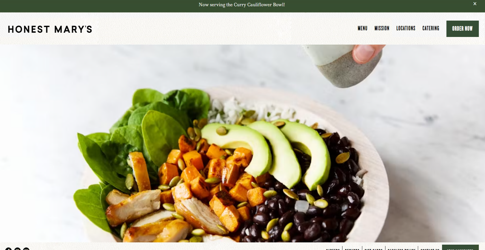

# 🍜 HonestMarys - Restaurant Web Scraping Project 🍜

This flavorful Python-based project utilizes Selenium to scrape and gather information about our handpicked restaurant, HonestMarys. 🥗🌮🍲

## Tech Trifle Behind The Project 🕹️🛠️

**Web Scraping:** Much like squirrels hoarding nuts, we keep the interwebs order by "borrowing" large amounts of data from websites and neatly nestle it into a local file. 🌍💾

**Python:** Python is the mighty pen we wield that swirls the chaos of data into meaningful and well-structured information. An unassuming name for such a swiss-army knife of coding languages! 🐍🎩

**Selenium:** Our faithful steed, Selenium, is known for its ability to automate anything you see on a website. It's the oil to our web scraping engine! 🎢🌐

**Anti-bot systems & CAPTCHA:** Imagine you're Indiana Jones, and the CAPTCHAs and anti-bot systems are booby traps to your temple of treasures. We've got the secret map to safely navigate and ensure uninterrupted scraping! 🌁💎

## Fork it, Clone it, Use it! 🎯

Embark on this culinary voyage with HonestMarys. Let our scraper guide you through menus, reviews, ratings, and much more.

**More instructions here...**

## Lend A Helping Hand 🤝

Contributions, issues, and feature requests are as welcome as a dessert after a satisfying meal! Feel free to check out our [issues page](<Your Issues Page Link>).

## Get set, Ready, Scrape... and Bon Appétit! 🍽️🎉

---

## ©️2022 Your Name & The Web Scraping Team 🪄👨‍💻🍀

---
